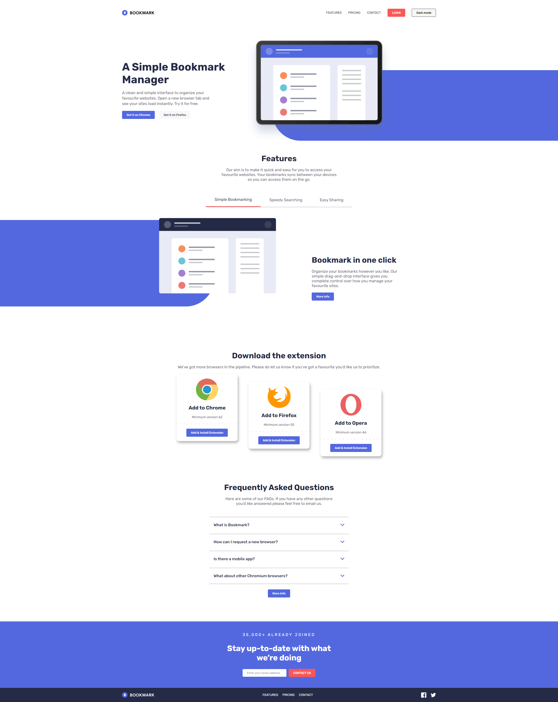

# Frontend Mentor - Bookmark landing page solution

This is a solution to
the [Bookmark landing page challenge on Frontend Mentor](https://www.frontendmentor.io/challenges/bookmark-landing-page-5d0b588a9edda32581d29158).
Frontend Mentor challenges help you improve your coding skills by building realistic projects.

## Table of contents

- [Overview](#overview)
    - [The challenge](#the-challenge)
    - [Screenshot](#screenshot)
    - [Links](#links)
- [My process](#my-process)
    - [Built with](#built-with)
    - [What I learned](#what-i-learned)
    - [Continued development](#continued-development)
    - [Useful resources](#useful-resources)
- [Author](#author)
- [Acknowledgments](#acknowledgments)

**Note: Delete this note and update the table of contents based on what sections you keep.**

## Overview

### The challenge

Users should be able to:

- View the optimal layout for the site depending on their device's screen size
- See hover states for all interactive elements on the page
- Receive an error message when the newsletter form is submitted if:
    - The input field is empty
    - The email address is not formatted correctly

### Screenshot



### Links

- Solution URL: [GitHub](https://github.com/CorentinTalour/Bookmark_landing_page)
- Live Site URL: [GitHub Pages](https://corentintalour.github.io/Bookmark_landing_page/)

## My process

### Built with

- Semantic HTML5 markup
- CSS custom properties
- Flexbox
- [React](https://reactjs.org/) - JS library
- [SCSS](https://sass-lang.com/) - CSS preprocessor

### What I learned

I learned how to make a dark theme with data-theme, and a variable to switch from light to dark theme :

```JS
const [isDark, setDark] = useLocalStorage("isDark", false);

<main data-theme={isDark ? "dark" : "light"}></main>
```

```css
:root {
    --soft-blue: hsl(231, 69%, 60%);
    --very-dark-blue: hsl(0, 94%, 66%);

    [data-theme="dark"] {
        --soft-blue: #252b46;
        --very-dark-blue: #b9bfda;
    }
}
```

### Useful resources

- [Youtube - React Dark Mode Toggle/Theme](https://www.youtube.com/watch?v=sy-rRtT84CQ) - This helped me for realize
  dark mode.

## Author

- Frontend Mentor - [@CorentinTalour](https://www.frontendmentor.io/profile/CorentinTalour)
